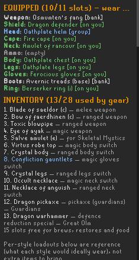

# CoX Gear Planner

A RuneLite plugin that plans a **Chambers of Xeric** loadout from the gear you
actually own — personal bank, inventory, worn equipment and **Group Ironman
shared storage** — using OSRS DPS maths for the rooms in your raid.



## What it actually does

You tick the rooms in your layout (or import scout text from the clipboard)
and press **Suggest gear setup**. It then:

1. **Works out what you own.** Every item in your inventory, worn equipment,
   bank and shared storage is read through the client's own item database, so
   each item's real slot and stats are used rather than a hand-written list.
   New gear works with no plugin update. Uncharged, inactive and broken items
   count as owned and are flagged **CHARGE IT FIRST**.
2. **Estimates a time for every target** using the standard OSRS accuracy and
   max-hit formulas with your live boosted stats.
3. **Chooses a base outfit** by trying each combat style as the worn set,
   choosing its switches, and keeping whichever gives the lowest total time.
4. **Decides which switches earn their slot**, priced in seconds saved, under
   either a per-style cap or one shared budget across all styles.
5. **Prints one concrete layout**: 11 worn slots, the items in your 28-slot
   inventory, and how many slots are left for supplies.

Items are coloured by what they are for (melee red, ranged green, magic blue,
utility grey) with a separate tag for where they currently are.

### Things it knows that raw stats don't tell you

- **Multi-target rooms.** Olm is three targets with opposite defences (melee
  left claw, magic right claw, ranged head). Vanguards are three, each soft to
  one style. Muttadiles are two. Vasa is two — himself plus the crystal.
  Tightrope is the ranger and the mage.
- **Positional reality.** Melee cannot reach the tightrope platforms. The
  Guardians take damage only from pickaxes. Skeletal Mystics are safespotted.
  The abyssal portal at Vespula sits 8 tiles out, so a 10-tile bow stays on
  rapid while a 7-tile weapon must use longrange and loses a tick.
- **Effects that are not in item stats**: twisted bow scaling, dragonbane,
  demonbane, salve amulet, crystal armour, void, obsidian, Inquisitor's crush
  bonus, tome of fire, powered-staff speeds, the Guardians' pickaxe damage
  formula, and Vasa's crystal being melee-only.
- **Which attack style to use** — a fang left on slash hits the Vasa crystal's
  +180 defence instead of its -5.

## Sharing a plan

**Copy plan for a friend** puts the whole plan on your clipboard as plain text
and writes `cox-gear-plan.txt` to your `.runelite` folder. It includes the
settings and stats behind the plan, not just the item list, because a reviewer
cannot judge a loadout without knowing what constrained it.

## Settings worth knowing

| Setting | What it does |
|---|---|
| Party size | Scales monster HP. See the caveat below |
| Minimum switch value | Seconds a switch must save to be worth a slot |
| Max items per switch | Per-style cap. Weapon counts, offhand is free |
| Total swap items | One shared budget across all styles; overrides the per-style cap |
| Force 4-tick weapons at Olm | Keeps melee and magic on one rhythm while learning |
| Assume overload | Boosts your stats as a CoX overload (+) would |
| Assume imbued heart | Competing magic boost. Does nothing while overloaded — see below |
| Show debug panel | Explains every weapon, switch and slot decision, and what each slot is worth in seconds |

## How gear is chosen

Armour used to be ranked by a made-up number — for magic, `magic damage x 15 +
magic attack`. That exchange rate was invented, and it gets the close calls
wrong, because the value of an accuracy bonus collapses once you are already
accurate. A seers ring is the honest example: at the Olm mage hand it is worth
under 1% more damage, but a score of 6 against a berserker ring's 0 made it
look like a real decision.

Every armour slot is now priced with the same DPS formulas that produce the
room times, against the monsters that style will actually be pointed at,
weighted by their health. The curated heuristic still runs first to narrow each
slot to six finalists — scoring every bank item against every target is a lot
of work for the same answer — but the choice between finalists is made on real
damage.

The debug panel reports what each slot is **worth in seconds**, both over the
next best thing you own and over leaving it empty. That is how you tell a real
choice from a slot that only had one plausible filling. If a ring is saving you
0.3 seconds across a whole raid, the panel now says so instead of implying it
earned its place.

**Known limitation, pinned by a test.** The search climbs one slot at a time,
so it cannot *discover* a set whose pieces are each individually worse than
what they replace — the first swap looks like a loss and is rejected before the
second can pay for it. Crystal armour is exactly that shape. It is still
chosen, because the heuristic seed favours crystal when you own a crystal bow,
and the search will not break the set up once seeded. That crystal weighting is
load-bearing, not legacy.

## The base outfit is priced against what it forces you to switch

Worn items are free — they cost no inventory slot and no swap budget — so the
plan will happily wear something worth a fraction of a second. That part is
fine. What was not fine is that the base outfit was chosen to maximise the
primary style's own damage **as though wearing it were free for everyone
else**, when in fact every slot where the base disagrees with another style
creates a switch, and a switch costs an inventory slot or a place in your swap
budget.

That is how a ring worth a fraction of a second could push out a necklace
worth six, and it is why the plan could look internally inconsistent: a
near-useless item worn, a clearly valuable one left behind.

The planner now tries wearing the secondary style's item in any slot where the
switch was worth something, and keeps the change whenever it lowers total raid
time — charging the primary style properly for what it gives up. The debug
panel logs these as `BASE <slot>: wearing X saves the <style> switch`.

This only changes the outcome when a swap budget or per-style cap is set. With
both left at 0 nothing is competing for slots, so every worthwhile switch is
carried anyway and there is nothing to trade.

## Prayer bonus decides what damage cannot

Gear is ranked by damage, but some slots make no difference to damage at all —
the clearest case being the ammo slot next to a bow of faerdhinen, which fires
no ammo. Every candidate ties, and the winner used to be whichever the bank
scan reached first. That is how broad arrows ended up equipped beside a bow
that cannot use them.

Two rules now apply:

- In the DPS search, a difference under **one second across the whole raid**
  is treated as noise, and the higher prayer bonus wins instead. Anything
  larger still goes to damage — prayer breaks ties, it does not outrank a real
  gain.
- In the heuristic that seeds the search, prayer is added with a small weight,
  enough to settle a tie and never enough to overturn a genuine offensive
  difference. This matters because the ammo and weapon slots are not part of
  the DPS search, so the heuristic is all they have.

Prayer bonus is not simulated as such — nothing here models drain rate or how
long your restores last. It is used as a tiebreaker because it is free value
in a slot that is otherwise doing nothing.

## The base outfit is not necessarily the base style's gear

Before v1.31 the worn set was, by definition, whatever the base style would
choose for itself. v1.31 allowed a slot to be traded to another style's item
to remove a switch, which broke that assumption in five separate places that
had quietly relied on it — the item list, the switch advice, the colouring,
the inventory, and the per-style view. Each showed up as a different symptom.

The rule now is explicit: **`resolve()` returns what is worn, `ownPicks()`
returns what the style would pick for itself.** Anything describing the
loadout wants the first; anything describing a switch wants the second. A
plan-level test asserts the inventory packs exactly what the switch decisions
say to carry, since every failure of this kind looked the same from the
outside — advice promising an item the inventory never listed.

## What the swap budget counts

**Total swap items** counts the gear switches competing for inventory space:
weapons and armour pieces. It deliberately does **not** count:

- **Offhands.** A dragon defender rides along with the weapon it pairs with,
  because putting both on is one swap, not two.
- **Utilities.** A lockpick or a dragon warhammer is brought because a room
  requires it, not because it won a comparison, so it is never dropped to make
  room for armour.

Both are still real inventory slots, so the gear total shown above the
inventory list will read higher than the budget you set — a budget of 10 with a
warhammer and a defender means 12 slots used. The settings line in an exported
plan spells this out.

## The imbued heart does nothing while overloaded

OSRS boosts do not stack — each sets an absolute level and the highest wins. A
CoX overload (+) gives `+6 and 16%` against the heart's `+1 and 10%`, which
beats it at every Magic level:

| Magic | Imbued heart | CoX overload |
|---|---|---|
| 75 | 83 | 93 |
| 90 | 100 | 110 |
| 99 | 109 | 120 |

So with **Assume overload** on — the default — enabling the heart changes
nothing. It only moves the numbers with overloads off, which is the realistic
case for the first rooms before you brew any. The plugin takes one stat
snapshot for the whole raid, so it cannot model "hearted for two rooms, then
overloaded"; run it twice to see both. A test asserts the overload wins at
every level, so this cannot quietly become an additive stack later.

## Building and running

Requires only a JDK (11+):

```
./gradlew runClient        # dev client with the plugin loaded
./gradlew build            # jar in build/libs, runs the test suite
```

---

# Limitations

**Read this before trusting a number.** The plugin is considerably better at
ranking gear than at predicting a run. Errors in monster HP cancel out when
comparing two of your own weapons against the same target, so "which of my
weapons is best here" survives mistakes that "this room takes 1:12" does not.

### The times are not predictions

Every time is expected kill time from DPS alone. It ignores movement, room
mechanics, phase transitions, downtime, prayer switching, eating, and special
attacks. Two rooms are especially misleading:

- **Vespula** is duty-cycle limited, not DPS limited. The Redemption method is
  attack, retreat, heal, restore prayer. The reported time is a **floor**.
- **Guardians** ignores their 1 HP per 8 ticks regeneration and the flinching
  most players do to dodge the stomp.

### Party scaling is the weakest number in the model

Jagex has never published the CoX scaling formula and the wiki does not carry
one. The linear-per-member figure used here comes from a wiki **talk page**,
not an article. Times also assume the party splits damage evenly, which is a
convenience rather than a fact. **Solo estimates are the most trustworthy.**

### Monster stats are the solo, maxed-player baseline

Every CoX infobox states its stats are "scaled for a player with maxed combat
stats", and the raid scales to the highest-combat player in the team. The
plugin uses that baseline and scales from it. **Challenge Mode is not modelled
at all.**

### Known approximations, and why

| Approximation | Why |
|---|---|
| Olm claw HP is per-phase, times three | The exact per-phase damage split is not published |
| Olm head's 66% non-ranged mitigation is not applied | The head heals if hit outside the final phase, so its HP realistically comes down during the phase where the mitigation is off |
| Demonbane bypassing the Ice Demon's 67% cut | Stated on the Ice demon and CoX strategy pages, but **not corroborated** by the `Demon (attribute)` mechanics page. The wiki's own Emberlight recommendation only makes sense under this reading |
| Muttadile meat-tree healing is not modelled | It is preventable; baking it in would overstate the room for anyone who stops them |
| Vasa crystal count is 1 | He siphons from one at a time, but may visit more than one in a fight |
| Armour is ranked by a strength-weighted score | Not a full per-monster DPS solve. Reported times always use the real formulas; only the *ordering* of candidates is heuristic |
| Weapon reach is a hand-maintained table | RuneLite's item stats do not expose attack range |

### Not modelled at all

- **Bolt proc effects** (ruby, diamond), which need a current-HP simulation
- **Special attacks.** DWH, BGS and elder maul are listed as utility items but
  their defence reduction is never simulated, so Tekton and Olm times ignore it
- **Thralls, Book of the Dead, poison, venom and burn effects**
- **Supplies.** The plan reports free slots but does not plan brews, restores
  or food
- **The berserker necklace's +20%** with obsidian weapons

### Known bugs

- **Item naming can be inconsistent** between the curated list and the item
  scanner — "Avernic treads" versus "Avernic treads (base)" can refer to
  different database entries for what looks like the same item.

### Operational limits

- **No automatic layout detection.** Reading the raid's rooms from inside CoX
  means decoding instance template chunks, as the built-in Raids plugin does.
  Room selection is manual or via clipboard import.
- **Shared storage is only known after you open the chest once.** Contents are
  remembered between sessions; use **Forget stored bank/group data** to reset.
- **Anything the client has not shown the plugin is invisible** — POH armour
  stand, looting bag, seed vault, or another account.

---

# Still to implement

PecanBread11's **Solo CoX points per hour** workbook is the community
reference. It is a different kind of model to this plugin — it is a routing
and efficiency model where you supply DPS figures, whereas this plugin derives
DPS from the gear in your bank. They are complementary, and the sheet exposes
several dimensions missing here entirely.

### Room variants are a whole missing dimension

Every CoX room generates in **three variants** — left-turning, straight and
right-turning — and they are not cosmetic. Measured tick counts from the sheet:

| Room | Left | Straight | Right |
|---|---|---|---|
| Crabs | 105 | 80.5 | 88 |
| Thieving | 144.4 | 150.8 | 148.3 |
| Tekton | 18.5 | 16.5 | 18.5 |

Crabs varies by 30% depending on which variant you get. This plugin models one
profile per room and cannot express this at all.

### Points per room, which is the real objective

| Room | Points | | Room | Points |
|---|---|---|---|---|
| Olm | 20,544 | | Guardians | 2,160 |
| Thieving | 4,485 | | Muttadiles | 2,160 |
| Tightrope | 4,073 | | Mystics | 2,074 |
| Ice demon | 3,701 | | Vasa | 1,855 |
| Vespula | 2,469 | | Shamans | 1,642 |
| Vanguards | 2,333 | | Crabs | 1,600 |
| | | | **Tekton** | **1,296** |

Tekton gives the **fewest points of any combat room** while being among the
slowest — a strategic conclusion this plugin structurally cannot reach, because
it only ever minimises time.

The sheet also shows that some actions are worth doing *despite* costing time:
downing Vespula is marked "worth it for points per hour" at an effective
237,930, as is killing the tightrope NPCs.

### Where the sheet independently agrees with this plugin

The sheet's per-target inputs imply which style and weapon its author expects,
and those match this plugin's conclusions on every case that can be checked:

| Target | Sheet's max hit | Implies | This plugin picks |
|---|---|---|---|
| Ice demon | 61 at 4 ticks | Emberlight (34 base x 1.805 demonbane) | Emberlight |
| Melee Vanguard | 75 | magic | magic (its magic defence is 20) |
| Range Vanguard | 52 | melee | melee (its stab defence is 55) |
| Olm melee hand | 52 | melee | melee |
| Olm mage hand | 75 | magic | magic |
| Olm head | 79 | ranged | ranged |
| Vasa crystal | 52, its own weapon entry | a separate melee weapon | decided on dps — see below |
| Guardians | 61 | pickaxe with the damage multiplier | pickaxe |

That the Ice demon figure reproduces Emberlight's demonbane maths, and that
both Vanguards land on opposite styles, is the closest thing to external
validation this plugin has had.

### Techniques and mechanics not modelled here

- **Tekton's enraged phase.** Accuracy drops from 0.579 to 0.384 — the plugin
  only carries non-enraged stats, so it overrates Tekton badly.
- **Tekton anvil mechanics**: 0/1/2-anvil probabilities, roughly a 25% 0-anvil
  rate in max gear with thralls and a free shadow hit during the lure.
- **Special attacks throughout**: 1 maul/DWH per Olm phase, ZCB on the head
  (88% accuracy) and on Vasa (90%), ZGS on the muttadiles.
- **Room techniques**: Vasa tech (entrance-dependent — leaving the proc tile on
  North/East rooms gains 8 attacking ticks), Vespula down tech, tightrope
  skipping, overthieving to 39 grubs.
- **Ice demon chopping strategy**, where 25/24/12 is optimal for speed but
  27/27/27 is optimal for points per hour — the same room, two different right
  answers depending on the objective.
- **Tick-level positioning.** Tekton start tiles are 5 tiles from the aggro
  radius "for maximal scythe/fang hits with 2 mauls, go 3 farther away or 1
  closer with a 4t weapon" — which means weapon speed and positioning interact.
- **Thralls**: 0.625 DPS, a 5.5-5.9% uplift.
- **Fixed dead time**: 25 ticks to reach Olm, 80 between phases, 30 back into
  a raid.

One discrepancy to chase: the sheet uses **703.2 HP for Olm's head** where this
plugin uses 800, though its author notes "the calcs here aren't amazing" on
that tab.

Roughly in order of value:

1. **Validate the DPS engine against a reference.** The wiki's own calculator
   (weirdgloop/osrs-dps-calc) is open source. Encoding around 30 fixtures
   spanning styles and effects, and asserting this engine matches, would turn
   "the formulas look right" into "the formulas are right".
2. **Expected-ranking tests.** Assert community consensus directly — tbow wins
   Olm's head, magic wins the right claw, stab wins the crystal — so the build
   fails when a change breaks one, instead of a user noticing.
3. **Per-monster DPS-based armour selection**, replacing the heuristic score,
   then verifying the greedy switch choice against exhaustive search on small
   candidate sets to measure how often greedy is wrong.
4. **Fix the two known combat bugs** above (fang stab-only, scythe on 2x2).
5. **Special attack simulation** (elder maul, DWH, ZCB), quantified above at
   roughly 11.6% of Olm melee time-to-kill, plus **bolt procs**.
6. **Points per hour**, which is what the community actually optimises. Needs
   the CoX points formula plus the fixed overheads above, so that the output
   becomes points/hour rather than raw kill time.
7. **Thralls**, a flat 0.625 DPS and about a 5.5% uplift.
8. **Challenge Mode**, largely a 1.5x stat multiplier plus different tactics.
9. **Empirical validation in-game** — subscribe to hitsplat events and compare
   observed hit rate and average damage against predicted, over real raids.
   The strongest possible evidence, and the slowest to gather.

# Accuracy and sourcing

Monster stats, scaling and item effects are taken from the OSRS Wiki and
pinned by tests. Where the wiki is silent or contradicts itself, the code says
so in a comment and this file records the caveat. Item stats themselves always
come from the client, never from a hardcoded table.

The test suite covers the combat formulas, the item data, the room
constraints, and the consistency rule that **every item named in a per-style
section must be either equipped or in the inventory list** — a rule that has
caught several real bugs.

Data lives as plain editable tables: `RoomMonsters.java` for monster stats and
room mechanics, `GearDatabase.java` for the curated weapon and ammo tiers,
`ChargedVariants.java` for uncharged item mappings.

---

# Change history

Newest first. Entries marked *(superseded)* describe behaviour that has since
been replaced.

| Version | Change |
|---|---|
| 1.36.1 | Crash: an empty ammo slot hit a curated list that names no ammunition for melee or magic |
| 1.36 | The base outfit no longer claims a shield behind a two-handed weapon or ammo for a bow that fires none |
| 1.35.2 | Over-limit lines named the per-style cap even when a shared swap budget was the real constraint, reading "exceeds your 0-item switch" |
| 1.35.1 | The switch-back guard vetoed every useful base-outfit trade, keeping 0.7s items equipped while 5s switches went uncarried |
| 1.35 | Already-worn slots now show what they are worth, so every line in the switch advice carries a number |
| 1.34 | Prayer bonus decides slots the clock cannot separate, so an empty-value slot no longer goes to whatever the bank scan reached first |
| 1.33 | Swept every consumer of the base outfit after the v1.31 trade broke the assumption that it is the base style's own gear |
| 1.32.2 | Switches the advice said to carry were missing from the inventory; base-outfit trades that only moved a switch instead of removing it are now rejected |
| 1.32.1 | Worn items were all coloured as the base style, so a traded-in melee helm showed as magic |
| 1.32 | The base style can now switch back into its own gear, after a slot was traded away from it |
| 1.31.1 | The traded base outfit was computed but never displayed — the item list showed the untraded one, so a swapped-in ring vanished from the plan |
| 1.31 | Base outfit priced against the switches it forces, instead of only its own style's damage |
| 1.30 | Armour ranked by real DPS instead of a heuristic score; debug panel reports what each slot is worth in seconds |
| 1.29 | Imbued heart, as a competing boost — a CoX overload beats it at every level |
| 1.28 | Scythe hit chain corrected (halved and rounded down, hit count by target size); fang's double roll limited to stab |
| 1.27.1 | Corrected an overstated claim about stab on Vasa's crystal |
| 1.27 | Tekton's enraged phase modelled separately |
| 1.26 | Items coloured by combat style, with location as a separate tag |
| 1.25.2 | Swap budget counted only one weapon per style, so a budget of 10 packed 14 items |
| 1.25.1 | A weapon used in three rooms was never carried; equipped ammo slot disagreed with the sections; export omitted the active limit |
| 1.25 | Vasa's crystal became a real target with its wiki stats, replacing a hardcoded stab list *(supersedes 1.24)*; room lines now name the melee attack style |
| 1.24 | Stab weapon added as a Vasa requirement *(superseded by 1.25)* |
| 1.23 | One shared swap budget across all styles |
| 1.22.1 | The large muttadile can be meleed once it emerges |
| 1.22 | Base outfit chosen by lowest total raid time, not most combat seconds; offhand counts as part of the weapon swap |
| 1.21.1 | Dropped the axe requirement at the Ice Demon — the room spawns one |
| 1.21 | Shareable plan export; fixed version drift across three files |
| 1.20 | Vespula modelled as the 8-tile portal reach problem |
| 1.19 | Room times were party-size too long; Guardians given their real HP formula and pickaxe damage multiplier; Vespula retargeted at the portal |
| 1.18 | Ice Demon corrected — no fire staff needed, demonbane modelled |
| 1.17 | Force 4-tick weapons at Olm; style sections split per weapon |
| 1.16 | Per-room style constraints and mechanical preferences |
| 1.15 | Monster stats and party scaling re-sourced from the wiki |
| 1.14 | Per-style sections derived from the loadout so they cannot disagree with it |
| 1.13 | Max items per switch |
| 1.12 | Debug panel showing full weapon rankings and ownership |
| 1.11 | Complete-set bonuses: void and obsidian |
| 1.10 | Eye of ayak, dragon hunter lance, Inquisitor's, tome of fire |
| 1.9 | Uncharged, inactive and broken items count as owned |
| 1.8.1 | Group storage was reading the player's own inventory container |
| 1.8 | Olm modelled as three separate targets |
| 1.7 | Salve amulet at Skeletal Mystics |
| 1.6 | Explicit 11-slot and 28-slot layout; greedy switch selection |
| 1.5 | Armour chosen by scanning every owned item's real stats |
| 1.4 | Crystal armour set effect; broader gear database |
| 1.3 | Single raid loadout view |
| 1.2 | Switch advice with a minimum switch value |
| 1.1 | Room time estimates from DPS |
| 1.0 | Initial gear planner |
